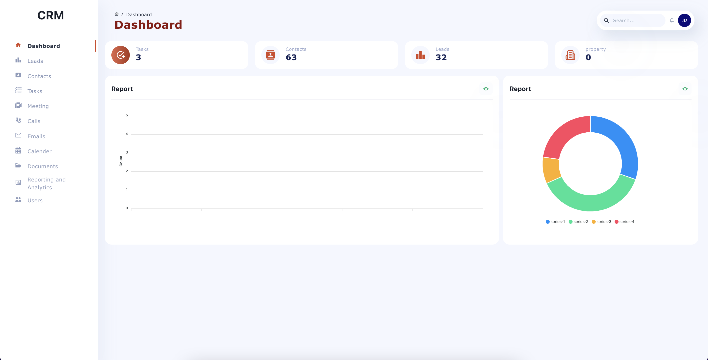
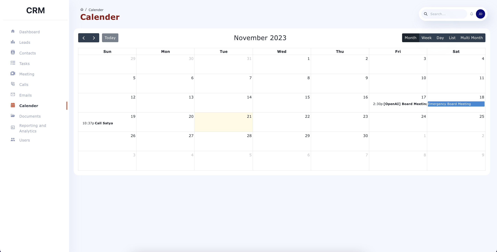

# Overview

Welcome to the Customer Relationship Management (CRM) project! This system helps manage customer interactions and internal tasks efficiently. It uses React for the frontend, Express for the backend, and MongoDB for the database. Below are the details of the project's objectives, technical design, and installation guide.

## Table of Contents
   - [Objectives](#objectives)
   - [Technical Design](#technical-design)
   - [User Interface](#user-interface)
   - [Installation Guide](#installation-guide)

## Objectives

**MongoDB Expertise:** Gain hands-on experience with MongoDB, including database operations and advanced features.

**Server-Side Programming:** Improve server-side programming skills using Express.js, focusing on complex functionalities, API design, and performance optimization.

**UI Libraries:** Utilize Chakra-UI and Material-UI for the frontend.

## Technical Design

### Frontend (React)

- **Dashboard Pages**: Central hub displaying summaries of contacts, tasks, and leads.
- **Contact Management**: Add, view, and edit contact information.
- **Task Management**: Manage tasks and link them to contacts or leads.
- **Other Features**: Manage meetings, call logs, email history, documents, and more.

### Backend (Express with MongoDB)

- **API Routes**: CRUD operations for contacts, tasks, meetings, etc.
- **Controllers**: Handle requests and interact with MongoDB.
- **Database Interaction**: Use Mongoose models for MongoDB collections.

Data Flow Example:
1. **User Interaction**: Submit contact form in the frontend.
2. **API Call**: `postApi` in `api.js` sends data to the backend.
3. **Backend Processing**: Route in `_routes.js` calls function in `contact.js`.
4. **Database Operation**: Function in `contact.js` updates MongoDB.
5. **Response Handling**: Server response is sent back to the frontend.

  

### Database (MongoDB)

#### Overview

The CRM's database is hosted on MongoDB Atlas (M0 Sandbox tier).

#### Collections

The database includes several collections:

1. **Contacts:** Customer contact information.
2. **Documents:** Data related to customers and transactions.
3. **Email Histories:** History of emails sent and received.
4. **Leads:** Potential customer or client information.
5. **Meeting Histories:** Details of past meetings.
6. **Phone Calls:** Logs of phone call interactions.
7. **Properties:** Details of properties associated with clients or leads.
8. **Tasks:** Tasks and assignments within the CRM.
9. **Text Messages:** Records of text message communications.
10. **Users:** User account information and credentials.

#### Schema Overview

- **User-Centric Design:** The schema centers around the `USER` entity, tracking user activities across various entities like contacts, leads, and email histories.
- **Activity Tracking:** Entities like `CONTACT`, `LEAD`, and `EMAIL-HISTORY` capture detailed CRM activity information.

  

## Summary
- **Frontend**: Built with React for user experience.
- **Backend**: Developed with Express and MongoDB for data and business logic.
- **Security**: Uses JWT tokens for authorization and secure data access.

## User Interface
### 1. Login

  

### 2. Home Page

  

### 3. Contacts Page

  

### 3.a Add Contact

  

### 4. Calendar

  

### 4.a Add Calendar

  

### 5. Documents

  

## Installation Guide

### Prerequisites

Ensure these tools are installed:

1. **Node.js and npm**:
   - **Download Node.js**: Visit [Node.js](https://nodejs.org/) and download the LTS version.
   - **Install Node.js**: Run the installer and follow the prompts. Ensure npm is included.
   - **Verify Installation**: Run `node -v` and `npm -v` in the terminal.

2. **MongoDB Compass** (Optional):
   - Download MongoDB Compass or create an account on MongoDB Atlas.

### Frontend Installation

1. **Download Project**:
   - Download the project ZIP from GitHub.

2. **Extract ZIP**:
   - Extract the ZIP to a preferred directory.

3. **Open Terminal**:
   - Open a terminal or command prompt.

4. **Navigate to Project**:
   - Use `cd path/to/project-directory`.

5. **Install Dependencies**:
   - Run `npm install` or `yarn install`.

6. **Start Development Server**:
   - Run `npm start` or `yarn start`.

7. **Change baseUrl**:
   - Open `constant.js` and change `baseUrl` to your backend server URL (e.g., `http://127.0.0.1:5001/`).

8. **Access Application**:
   - Navigate to `http://localhost:3000` in a browser.

### Backend Installation

1. **Download Backend Project**:
   - Download the backend project ZIP from GitHub.

2. **Extract and Navigate**:
   - Follow steps 2 and 4 as above for the backend project.

3. **Install Dependencies**:
   - Run `npm install` or `yarn install`.

4. **Configure Database**:
   - Create a `.env` file in the project directory.
   - Add `DB_URL = [your MongoDB URL]` and `DB = [your MongoDB Database Name]`.

5. **Start Server**:
   - Run `npm start`.

6. **Open Application**:
   - Navigate to `http://localhost:3000`.

### Default Admin Access

(not functional on AWS deployment)
- **Email**: admin@gmail.com
- **Password**: admin123
